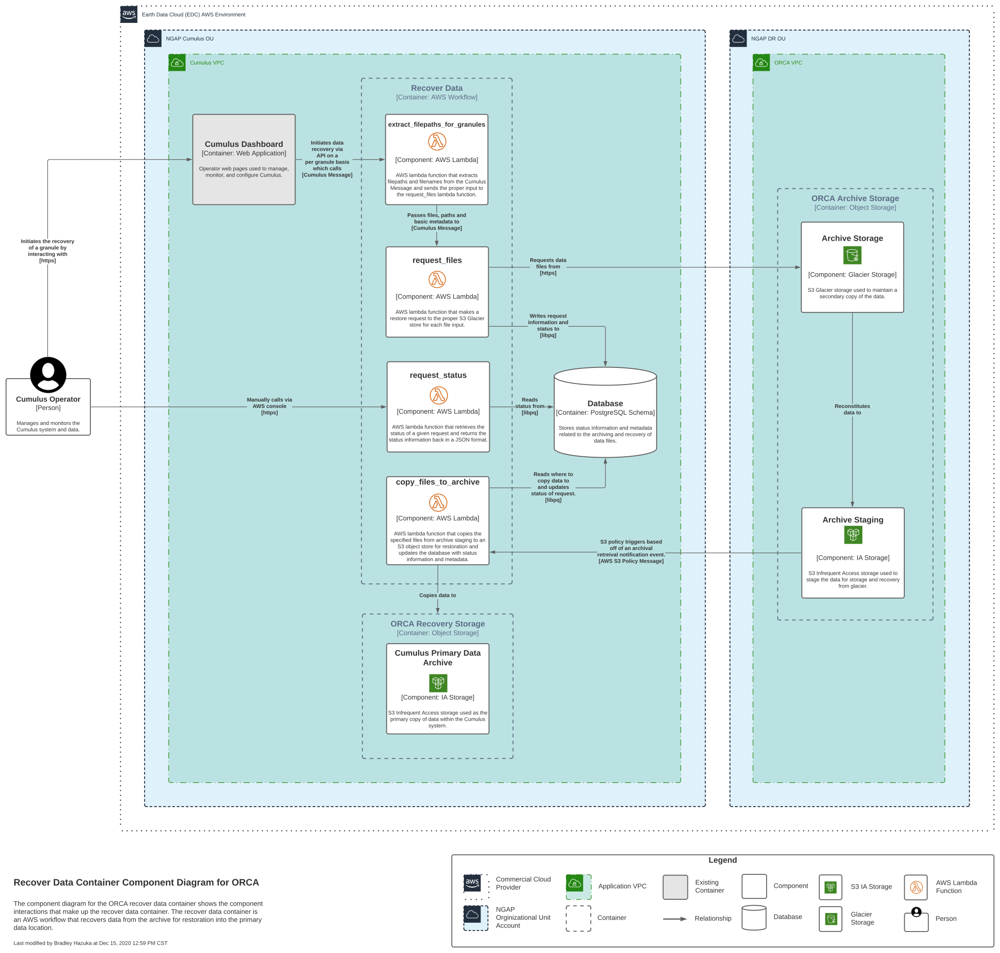

The ORCA recover data container contains all the components used in the recovery
of data from the secondary archive. The diagram below shows the various
interactions of these components. Recovery processes are kicked off manually
by an operator through the Cumulus Dashboard. The dashboard calls an API which
kicks off a recovery workflow. Recovery is an asynchronous operation since data
requested from Glacier can take up to 4 hours or more to reconstitute in most
scenarios. Since it is asynchronous, the recovery container relies on a database
to maintain the status of the request and event driven triggers to restore the
data once it has been reconstituted from Glacier into an S3 bucket. Currently
data is copied back to the Cumulus S3 primary data bucket as the final restore
step. Determining the status of the recovery job is done manually by either
using the provided request_status lambda or querying the database directly.

